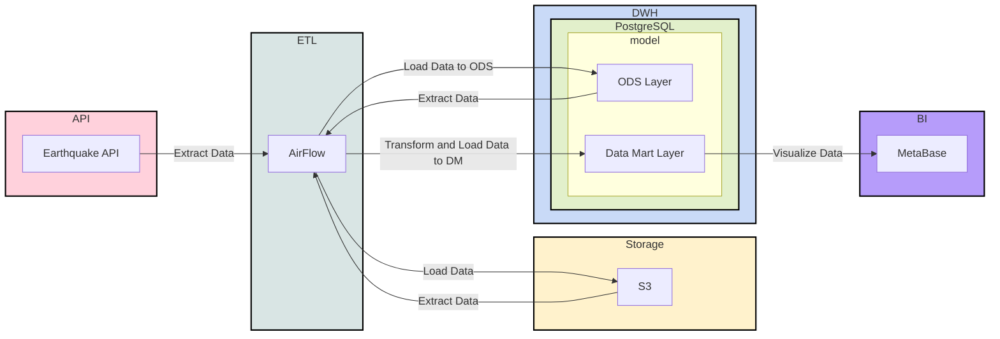

# Earthquake ETL Pipeline

Пайплайн для загрузки, хранения и анализа сейсмических событий: от сырых данных [USGS Earthquake API](https://earthquake.usgs.gov/fdsnws/event/1/) до витрин в PostgreSQL и дашбордов в Metabase.

---

## О проекте

Поток данных строится в три шага:

| Этап | Что происходит |
|------|----------------|
| **Extract → Load** | События забираются из USGS API и складываются в MinIO (S3-совместимое хранилище) |
| **Extract → Load** | Файлы из MinIO читаются через DuckDB и заливаются в PostgreSQL |
| **Transform → Load** | В Airflow считаются дневные агрегаты: средняя магнитуда и число событий в день |

Дашборды — в **Metabase**.

---

## Архитектура

Используется подход **Data Lakehouse**: сырые данные хранятся в объектном хранилище (MinIO), операционный слой и витрины — в PostgreSQL. Оркестрация пайплайнов — Apache Airflow.



---

## SQL-схемы и DDL

### Создание схем

```sql
CREATE SCHEMA ods;
CREATE SCHEMA dm;
CREATE SCHEMA stg;
```

### ODS: сырые события землетрясений

```sql
CREATE TABLE ods.fct_earthquake
(
	time varchar,
	latitude varchar,
	longitude varchar,
	depth varchar,
	mag varchar,
	mag_type varchar,
	nst varchar,
	gap varchar,
	dmin varchar,
	rms varchar,
	net varchar,
	id varchar,
	updated varchar,
	place varchar,
	type varchar,
	horizontal_error varchar,
	depth_error varchar,
	mag_error varchar,
	mag_nst varchar,
	status varchar,
	location_source varchar,
	mag_source varchar
);
```

### DM: количество событий по дням

```sql
CREATE TABLE dm.fct_count_day_earthquake AS 
SELECT time::date AS date, count(*)
FROM ods.fct_earthquake
GROUP BY 1;
```

### DM: средняя магнитуда по дням

```sql
CREATE TABLE dm.fct_avg_day_earthquake AS
SELECT time::date AS date, avg(mag::float)
FROM ods.fct_earthquake
GROUP BY 1;
```

---

## Запуск проекта

### Создание виртуального окружения

**Linux / macOS:**

```bash
python3.12 -m venv venv && \
source venv/bin/activate && \
pip install --upgrade pip && \
pip install -r requirements.txt
```

**Windows (PowerShell):**

```powershell
python -m venv venv
.\venv\Scripts\Activate.ps1
pip install --upgrade pip
pip install -r requirements.txt
```

### Развёртывание инфраструктуры

Запуск стека (PostgreSQL DWH, MinIO, Airflow, Redis, Metabase):

```bash
docker-compose up -d
```

После старта:

- **Airflow** — http://localhost:8080 (логин/пароль: `airflow` / `airflow`)
- **MinIO Console** — http://localhost:9001 (логин/пароль: `minioadmin` / `minioadmin`)
- **Metabase** — http://localhost:3000

---

## Структура репозитория

```
pet_project_etl_pipeline/
├── dags/                          # DAG-и Airflow
│   ├── raw_from_api_to_s3.py      # Загрузка с API в MinIO
│   ├── raw_from_s3_to_pg.py       # Перенос из MinIO в PostgreSQL
│   ├── fct_count_day_earthquake.py
│   └── fct_avg_day_earthquake.py
├── docker-compose.yaml            # Инфраструктура (Airflow, MinIO, Postgres, Metabase)
├── requirements.txt
└── README.md
```
