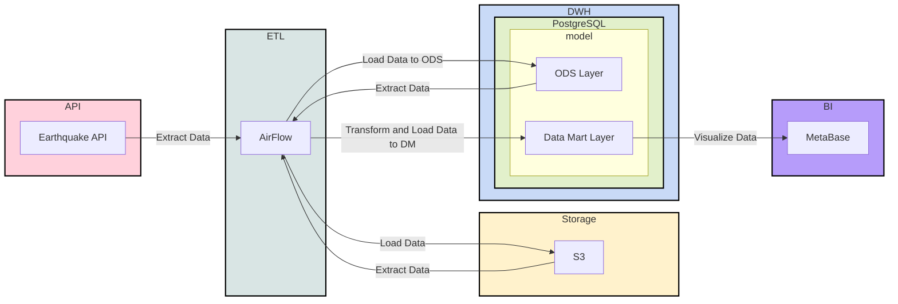
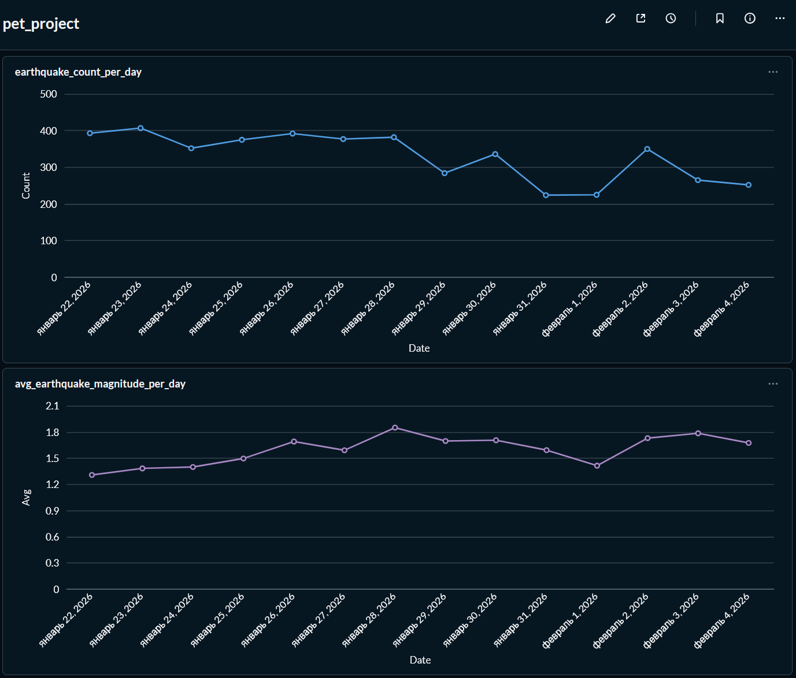

# ETL Pipeline

**Проект по построению ETL-пайплайна для обработки данных.**

Данные забираются из внешнего API, сохраняются в объектном хранилище, затем загружаются в хранилище данных и на их основе строятся витрины для анализа.

- **Источник данных**: внешнее API;  
- **Объектное хранилище**: MinIO (S3-совместимое);  
- **Хранилище данных и витрины**: PostgreSQL (уровни `ods` и `dm`);  
- **Оркестрация задач**: Apache Airflow;  
- **Аналитика**: Metabase.  

Пайплайн включает четыре основных шага:

1. **Загрузка сырых данных**: получение событий из внешнего API и сохранение файлов в бакет MinIO.  
2. **Загрузка в DWH**: чтение файлов из MinIO с использованием DuckDB и загрузка данных в таблицу `ods.fct_earthquake` в PostgreSQL.  
3. **Формирование витрин**: расчёт дневных агрегатов (количество событий и среднее значение показателя) в слое `dm`.  
4. **Отчёты и дашборды**: использование витрин в Metabase для построения визуализаций.

---

## Архитектура

Архитектура близка к подходу **Data Lakehouse**: сырые данные лежат в объектном хранилище, а очищенные данные и витрины — в реляционной базе; выполнение задач по расписанию берёт на себя Airflow.



---

## SQL-схемы и DDL

### Создание схем

```sql
CREATE SCHEMA ods;
CREATE SCHEMA dm;
CREATE SCHEMA stg;
```

### ODS: сырые события землетрясений

```sql
CREATE TABLE ods.fct_earthquake
(
	time varchar,
	latitude varchar,
	longitude varchar,
	depth varchar,
	mag varchar,
	mag_type varchar,
	nst varchar,
	gap varchar,
	dmin varchar,
	rms varchar,
	net varchar,
	id varchar,
	updated varchar,
	place varchar,
	type varchar,
	horizontal_error varchar,
	depth_error varchar,
	mag_error varchar,
	mag_nst varchar,
	status varchar,
	location_source varchar,
	mag_source varchar
);
```

### DM: количество событий по дням

```sql
CREATE TABLE dm.fct_count_day_earthquake AS 
SELECT time::date AS date, count(*)
FROM ods.fct_earthquake
GROUP BY 1;
```

### DM: средняя магнитуда по дням

```sql
CREATE TABLE dm.fct_avg_day_earthquake AS
SELECT time::date AS date, avg(mag::float)
FROM ods.fct_earthquake
GROUP BY 1;
```

---

## Запуск проекта

Ниже — пошаговый чек-лист от подготовки окружения до дашбордов.

### 1. Подготовить Python-окружение и зависимости

**Linux / macOS:**

```bash
python3.12 -m venv venv && \
source venv/bin/activate && \
pip install --upgrade pip && \
pip install -r requirements.txt
```

**Windows (PowerShell):**

```powershell
python -m venv venv
.\venv\Scripts\Activate.ps1
pip install --upgrade pip
pip install -r requirements.txt
```

### 2. Поднять Docker-инфраструктуру

Запуск сервисов:

```bash
docker-compose up -d
```

После старта сервисы доступны по адресам:

- **Airflow** — http://localhost:8080 (логин/пароль: `airflow` / `airflow`)
- **MinIO Console** — http://localhost:9001 (логин/пароль: `minioadmin` / `minioadmin`)
- **Metabase** — http://localhost:3000

### 3. Создать бакет в MinIO

1. Зайти в MinIO Console: http://localhost:9001  
2. Авторизоваться (`minioadmin` / `minioadmin`).  
3. Создать бакет с именем **`pet-project-etl`**.

### 4. Добавить ключи доступа MinIO в Airflow Variables

В Airflow (http://localhost:8080):

1. Открыть **Admin → Variables**.  
2. Создать переменные:
   - `access_key` — access key пользователя MinIO;
   - `secret_key` — secret key пользователя MinIO.

### 5. Подготовить схемы и таблицы в PostgreSQL DWH

Подключиться к `postgres_dwh` (см. `docker-compose.yaml`) и выполнить DDL из раздела **SQL-схемы и DDL**:

1. Создать схемы `ods`, `dm`, `stg`.  
2. Создать таблицу `ods.fct_earthquake`.  
3. (При необходимости) пересоздать витрины `dm.fct_count_day_earthquake` и `dm.fct_avg_day_earthquake`.

### 6. Добавить подключение к DWH в Airflow

1. В Airflow открыть **Admin → Variables** и создать переменную `postgres_dwh` (при необходимости, для DAG-ов).  
2. В **Admin → Connections** создать подключение:
   - `Conn Id`: `postgres_dwh`  
   - `Conn Type`: `Postgres`  
   - Host, Port, Login, Password, Schema — в соответствии с сервисом `postgres_dwh` из `docker-compose.yaml`.

### 7. Запустить DAG-и в Airflow

1. Убедиться, что DAG-и из папки `dags/` видны в веб-интерфейсе Airflow.  
2. Включить:
   - `raw_from_api_to_s3` — загрузка сырых данных в MinIO;
   - `raw_from_s3_to_pg` — перенос в PostgreSQL;
   - `fct_count_day_earthquake` и `fct_avg_day_earthquake` — построение витрин.

### 8. (Опционально) Настроить дашборды в Metabase

1. В Metabase подключить PostgreSQL DWH.  
2. Использовать таблицы `dm.fct_count_day_earthquake` и `dm.fct_avg_day_earthquake` для построения дашбордов по динамике количества событий и средней магнитуды.

---

## Структура репозитория

```
pet_project_etl_pipeline/
├── dags/
│   ├── raw_from_api_to_s3.py
│   ├── raw_from_s3_to_pg.py
│   ├── fct_count_day_earthquake.py
│   └── fct_avg_day_earthquake.py
├── docs/
│   ├── dashboard_example.png
├── docker-compose.yaml
├── requirements.txt
├── .gitignore
└── README.md
```

---

## Пример дашборда в Metabase

  
